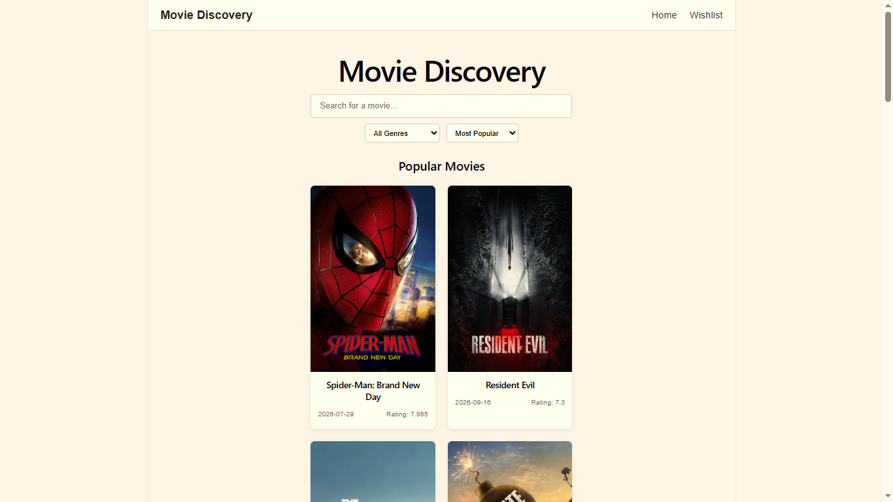
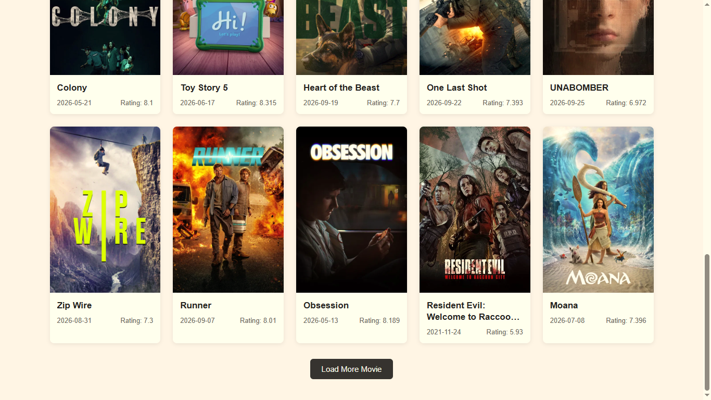
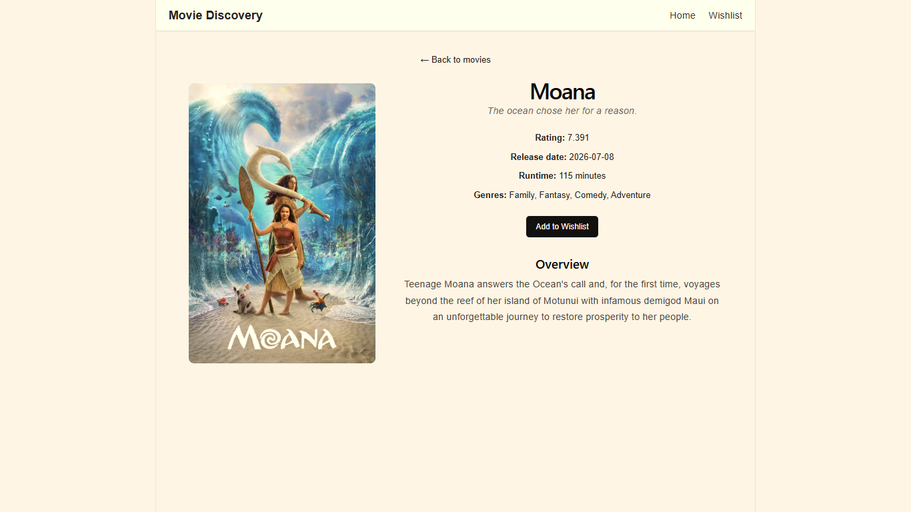
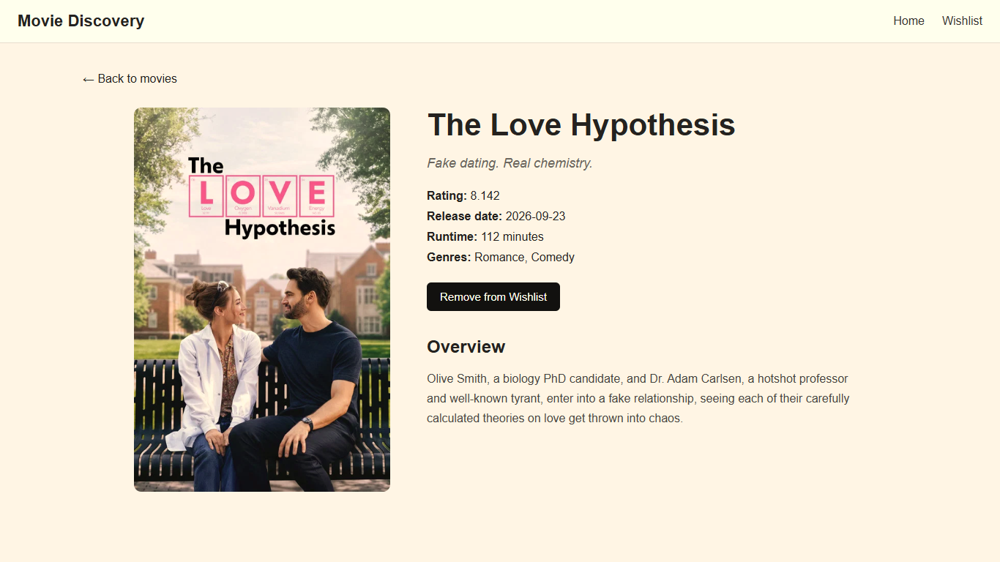
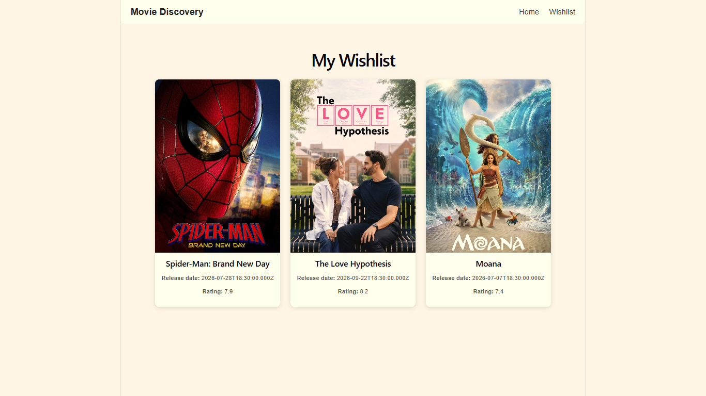

# Movie Discovery App

A full-stack movie discovery application built with React and Node.js. The application allows users to browse popular movies, search for movies, filter and sort results, view movie details, and maintain a persistent wishlist.

## Features

* Browse popular movies
* Search for movies by title
* Filter movies by genre
* Sort movies by popularity, rating, newest, or oldest
* Load more movies as users continue browsing
* View detailed movie information
* Add and remove movies from a persistent wishlist
* Access the wishlist after closing and reopening the application
* Loading, empty-state, and error feedback
* Responsive layout for different screen sizes

## Screenshots

### Home / Movie Discovery



### Movie Details



### Wishlist


## Tech Stack

### Frontend

* React
* React Router
* Vite
* CSS

### Backend

* Node.js
* Express.js
* Axios

### Database

* PostgreSQL

### External API

* TMDB (The Movie Database) API

## Application Architecture

The frontend communicates with the Node.js backend rather than calling TMDB directly.

```text
React Frontend
      |
      v
Node.js / Express Backend
      |
      +------------------+
      |                  |
      v                  v
   TMDB API          PostgreSQL Database
   (Movies)           (Wishlist)
```

The backend acts as an abstraction layer between the frontend and TMDB. Movie data received from TMDB is transformed into the format required by the application before being returned to the frontend.

## Project Structure

```text
movie-discovery-app/
│
├── frontend/
│   ├── src/
│   │   ├── api/
│   │   ├── components/
│   │   ├── pages/
│   │   └── ...
│   └── package.json
│
├── backend/
│   ├── routes/
│   ├── services/
│   ├── ...
│   └── package.json
│
├── README.md
└── ...
```

## Setup

### Prerequisites

Make sure the following are installed:

* Node.js
* npm
* A TMDB API key

### 1. Clone the repository

```bash
git clone <your-github-repository-url>
cd movie-discovery-app
```

### 2. Configure the backend

Navigate to the backend:

```bash
cd backend
npm install
```

Create a `.env` file inside the `backend` folder:

```env
TMDB_API_KEY=your_tmdb_api_key
```

Do not commit the `.env` file to GitHub.

Start the backend:

```bash
npm run dev
```

The backend runs on:

```text
http://localhost:5000
```

### 3. Start the frontend

Open another terminal:

```bash
cd frontend
npm install
npm run dev
```

The frontend will be available at the URL provided by Vite, usually:

```text
http://localhost:5173
```

## Backend API

The backend exposes endpoints for movie discovery and wishlist functionality.

### Movie APIs

```text
GET /api/movies/popular
GET /api/movies/search?q=<query>
GET /api/movies/genres
GET /api/movies/discover?genre=<genreId>&sortBy=<sortOption>
GET /api/movies/:id
```

### Wishlist APIs

The wishlist is handled through the backend and persisted in the database.

## Technical Decisions

### Backend abstraction for TMDB

The frontend does not communicate directly with TMDB. Requests go through the Node.js backend, which keeps the external API integration in one place and prevents the TMDB API key from being exposed to the client.

### Movie data transformation

TMDB responses are transformed by the backend before being returned to the frontend. This keeps the frontend independent of the exact structure of the external API response.

### Pagination

Movie results are loaded page by page instead of loading a large collection at once. Users can use the "Load More" functionality to continue exploring results.

### Search handling

Search requests use a short delay before making the request so that rapid typing does not immediately trigger a request for every individual keystroke.

### Persistent wishlist

Wishlist information is stored in the backend database rather than only in frontend state, allowing wishlist items to remain available after the application is closed and reopened.

## Assumptions

* TMDB is available and accessible when movie data is requested.
* Users have a valid TMDB API key configured in the backend environment.
* Wishlist data is stored for the application and does not require user authentication.
* Movie availability and metadata depend on the information provided by TMDB.

## Known Limitations

* The application does not currently include user authentication, so the wishlist is not associated with individual user accounts.
* Movie information depends on the availability and response of the TMDB API.
* The application relies on the configured external API key and local backend/database setup.

## AI Usage

AI tools were used occasionally to clarify technical concepts, understand API/library behavior, troubleshoot errors, and explore solutions when stuck. The final implementation and technical decisions were reviewed and understood by me.

## Future Improvements

With additional development time, the application could be improved by adding:

* User authentication and user-specific wishlists
* More advanced movie filtering
* Improved caching to reduce repeated external API requests
* More detailed error and retry handling for temporary API failures
* Further UI and responsive design improvements
* Additional automated testing

## License

This project was created as part of a full-stack development assignment.
